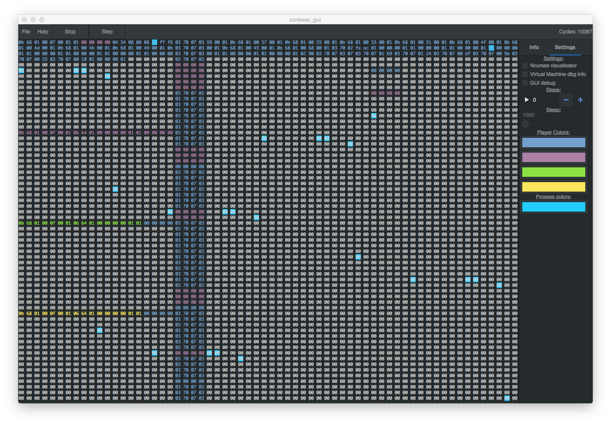
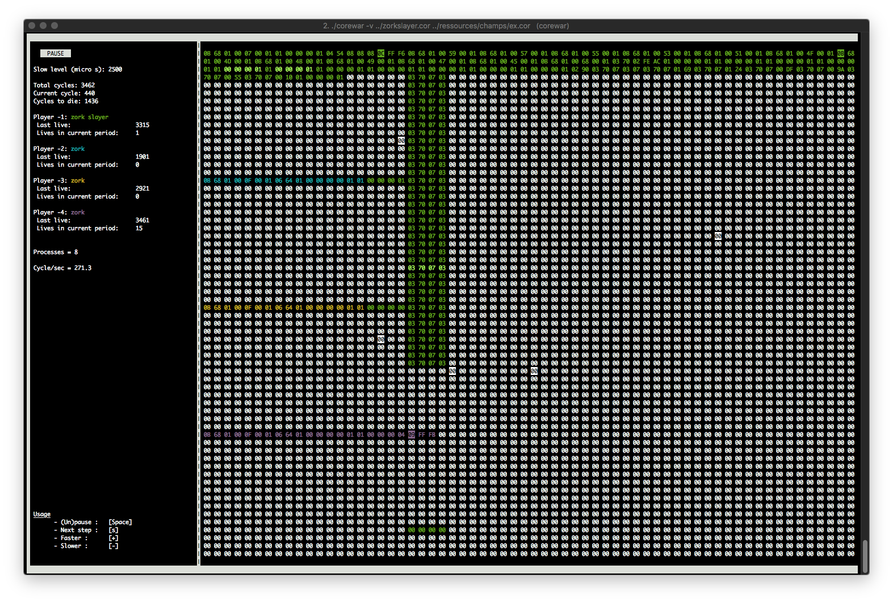

# Corewar

In this project, we created a virtual arena in which programs fight
against one another (the “Champions”). We also created an assembler to compile
those Champions. Finally we wrote our Champion, "Zorkslayer".

As a bonus we also created a Ncurses and a GTK interface.




## Usage
``` bash
$ ./corewar
$ ./corewar -v ../zorkslayer.cor ../ressources/champs/ex.cor
$ ./corewar_gui
```

## Installation
#### Without GTK
``` bash
git clone --recursive https://github.com/rbarbazz/corewar
cd corewar
make
```
#### With GTK
You'll need __gtk+3.0__ and the matching devel packages depending on your distribution.
Just run `make GTK_deps` if you're on MacOS.
``` bash
make GTK -j4
```
## Authors
- __[Mikael Samak](https://github.com/mickaelsamak)__ - VM and ASM
- __[Raphael Barbazza](https://github.com/rbarbazz/)__ - VM, ASM and champion
- __[Leo Compagnon](https://github.com/compalele)__ - VM and ncurses
- __[Xavier Perrin](https://github.com/selfsigned)__ - GTK and README.md
